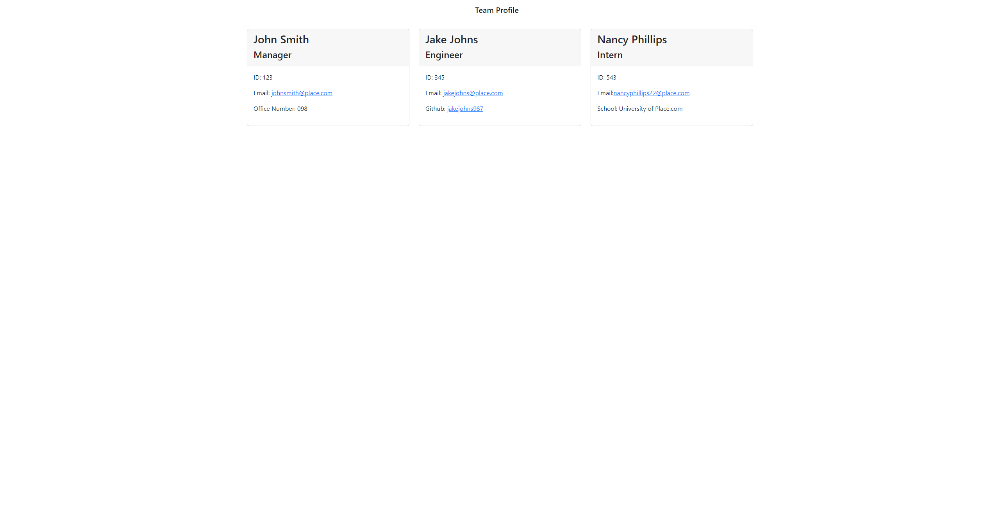

# Team Profile Generator

## Table of Contents

- [Description](#description)
- [Visuals](#visuals)
- [Resources](#resources)

## Description

Generates an HTML webpage with employee cards for a team profile. Accepts user input from the command line with inquirer prompts, and creates cards with the info that was input. Uses node.js file system functionality to create a file that contains the generated HTML webpage.

## Visuals

## Resources

[Repository](https://github.com/Bureizu742/team-profile-generator)

[Raw Generated HTML](https://raw.githubusercontent.com/Bureizu742/team-profile-generator/main/output/index.html)

[Video Demonstration](https://drive.google.com/file/d/17CYVpGw8H0ATYijEUH3TWeXl3RgUeXI3/view)